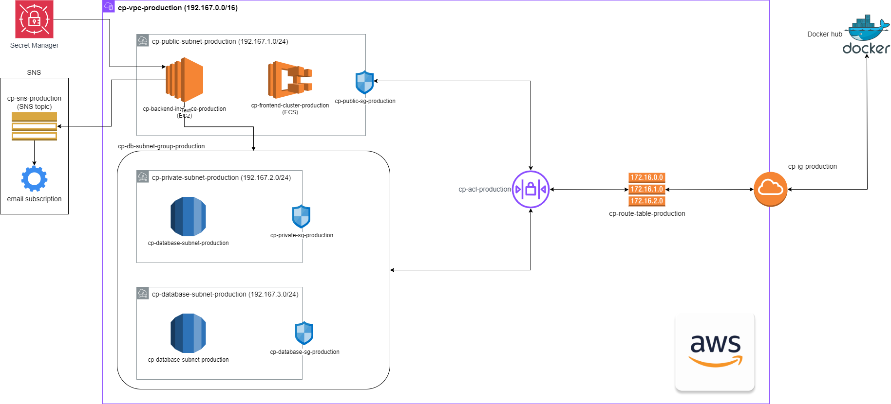
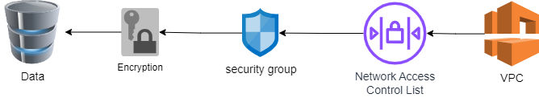

# Aws-cloud-project



## Application type : Web application
I have developed a simple web application using ReactJS for frontend and .NET framework for backend. It uses MySQL database for storage purposes. Functionality is quite simple. It is a job application tracking system. User can submit the data of applied job posting like job title, job description, company name, custom resume file, link to the job posting and save it. That job posting will be listed in table with link to the related uploaded resume. So, basically, it’s a CRUD application for job applications.

## AWS Services used

### 1. AWS EC2 (for Backend)

Available alternative to AWS EC2 for my backend application was using [AWS Elastic Beanstalk](https://aws.amazon.com/elasticbeanstalk/). I chose AWS EC2 over Elastic Beanstalk for my .NET backend application because EC2 offers greater control and customization, allowing me to fine-tune my server settings and optimize performance. This flexibility is important for handling high loads and unpredictable traffic patterns. EC2 also provides more granular cost management, as I can choose specific instance types and sizes that best match your needs, potentially reducing costs compared to the more automated but sometimes less efficient Elastic Beanstalk. With EC2, I have the option to use Reserved Instances or Spot Instances to further optimize costs.


### 2. AWS ECS (for Frontend)
Available alternatives for hosting my frontend application included using an AWS EC2 instance or AWS Elastic Beanstalk. I chose [AWS ECS](https://aws.amazon.com/ecs/) because ECS simplifies container management and deployment. With ECS, you can easily deploy, manage, and scale your containerized applications without dealing with the underlying infrastructure.

The frontend application will not experience the same level of load and incoming traffic compared to backend applications, so running an EC2 instance continuously could become costly. Regarding AWS Elastic Beanstalk, there is no direct option for hosting a ReactJS application, and one must write a servlet application to serve it, which complicates development and deployment. Hence, using AWS ECS with Docker containers is the optimal choice.

### 3. AWS Relational Database Service (RDS)
We have many alternatives available for [AWS RDS](https://aws.amazon.com/rds/) like AWS Aurora DB, DocumentDB, or [AWS DynamoDB](https://aws.amazon.com/dynamodb/). However, I chose AWS RDS for the following reasons:

- Aurora DB is costlier than AWS RDS as it creates a multi-node cluster, which is unnecessary for our application.
- AWS DocumentDB, DynamoDB, or any NoSQL database service is too complex for our application, as it only requires a simple SQL database.

AWS RDS is easier to configure as a managed service, so we don’t need to worry about the underlying infrastructure or database instance scaling.


### 4. AWS Virtual Private Cloud (VPC)
I have used [AWS Virtual Private Cloud (VPC)](https://aws.amazon.com/vpc/) to isolate my resources from others' resources. I created two VPCs: `cp-vpc-test` and `cp-vpc-production`, to isolate my resources related to test environments and production environments. 

There are three subnets: public subnet, private subnet, and database subnet. AWS RDS requires multiple availability zone subnet groups, so I created two private subnets as mentioned above. Our frontend application hosted in AWS ECS and backend application hosted in AWS EC2 instance are in the public subnet as they face the public internet for users to access. We have also configured Network Access Control List, Route table, Security groups, and an Internet gateway.

### 5. AWS SNS
We are using [AWS SNS](https://aws.amazon.com/sns/) to notify about the backend application startup. When our .NET application starts successfully, it publishes a message on an SNS topic. This topic is subscribed by an email subscription, which sends an email notification to a configured email address about the application startup.

### 6. AWS Secrets Manager
With [AWS Secrets Manager](https://aws.amazon.com/secrets-manager/), you can easily rotate, manage, and retrieve database credentials, API keys, and other secrets throughout their lifecycle. We stored our AWS RDS database connection string for the backend application developed in .NET.

## How security is ensured?



### Data at Rest

- Our AWS RDS instance resides in a private subnet (`192.167.2.0/24`), which is only accessible by the public subnet (`192.167.1.0/24`) and is not open to any other network or the internet.
- In our CloudFormation script, we've set the `StorageEncrypted` property to `true`, ensuring that data stored in RDS is encrypted. This means that even if a security breach occurs due to network vulnerabilities, the encrypted data remains secure and is essentially useless to anyone attempting to access it.

### Data in Transit

- Creating a VPC isolates our resources on the AWS Public Cloud from other users' resources on the platform. Configuring subnets, NACLs, internet gateways, and security groups adds multiple layers of security to our infrastructure and controls how data traffic flows.
- Our AWS RDS instance is in a private subnet (`192.167.2.0/24`) and is only accessible from the public subnet (`192.167.1.0/24`). It is not exposed to any other networks or the internet.
- Our network access control list named `cp-acl-production` ensures that traffic coming from the internet is only directed towards the public subnet. This adds another layer of security by denying any traffic directed towards subnets other than the public subnet.
- The RDS instance is associated with a private subnet security group named `cp-private-sg-production`, which has strict inbound rules. We only allow traffic from the public subnet (`192.167.1.0/24`) on port 1433, which is necessary for MySQL database connections. This approach secures our RDS from vulnerabilities caused by unwanted open ports.
- Our EC2 instance and ECS are located in the public subnet because they need to be accessed from the internet. They are associated with the public subnet security group, which has very specific inbound rules to ensure security.

## Cost analysis

### - Public cloud cost for our system

- Region: us-east-1
- Currency unit: USD
- Note: This cost is for minimal configuration of AWS services

| No | Entity name                            | Upfront cost | Monthly cost (operational) | Yearly cost (operational) |
|----|----------------------------------------|--------------|----------------------------|---------------------------|
| 1  | VPC                                    | 0            | 07.30                      | 087.60                    |
| 2  | Secret Manager                         | 0            | 00.40                      | 004.80                    |
| 3  | Key Management Service                 | 0            | 01.00                      | 012.00                    |
| 4  | EC2 Instance                           | 0            | 08.29                      | 099.48                    |
| 5  | ECS (Fargate)                          | 0            | 18.03                      | 216.36                    |
| 6  | RDS (MySQL)                            | 0            | 31.64                      | 379.80                    |
| 7  | SNS                                    | 0            | 00.00                      | 000.00                    |
| 8  | 10% usage variation                    | 0            | 06.66                      | 080.00                    |
| **Total (AWS-resource cost)**               | **0**        | **73.32**                  | **880.00**                |
| 9  | Cloud Architect (Human Resource)       | 0            | 8333.33                    | 100000.00                 |
| 10 | Laptop                                 | 800          | 00.00                      | 0.00                      |
| 11 | Internet (4G)                          | 0            | 35.00                      | 420.00                    |
| **Total (Other cost)**                      | **800**      | **8368.33**                | **100420.00**             |
| **Grand total (approx.)**                   | **800**      | **8441.65**                | **102173 USD (for 1st year)** |


### - On-premises datacentre cost for our system

- Region: Halifax
- Currency unit: USD

| No | Entity name                               | Upfront cost | Monthly cost (operational) | Yearly cost (operational) |
|----|-------------------------------------------|--------------|----------------------------|---------------------------|
|    | **Hardware resource cost**                |              |                            |                           |
| 1  | Primary internet (350 Mbps Eastlink)      | 00.00        | 84.00                      | 1008.00                   |
| 2  | Secondary internet (100 Mbps Bell)        | 00.00        | 80.00                      | 960.00                    |
| 3  | Firewall (Fortigate-40F +license)         | 408.00       | 50.00                      | 600.00                    |
| 5  | Network switch (Cisco 8 port)             | 72.00        | 05.00                      | 060.00                    |
| 6  | Server (Dell PE R250)                     | 1409.00      | 00.00                      | 00.00                     |
| 7  | Server rack (15 U)                        | 149.00       | 00.00                      | 00.00                     |
| **Total (Hardware resource cost)**             | **2038.00**  | **219.00**                 | **2628.00**               |
|    | **Other cost**                            |              |                            |                           |
| 8  | Primary power source (NS Power)           | 150.00       | 200.00                     | 2400.00                   |
| 9  | Secondary power source (UPS)              | 270.00       | 27.91                      | 334.92                    |
| 10 | Air conditioning                          | 800.00       | 150.00                     | 1800.00                   |
| 11 | Laptop (console system)                   | 800.00       | 00.00                      | 00.00                     |
| 12 | MySQL license (standard)                  | 00.00        | 166.66                     | 2000.00                   |
| 13 | Network and security admin                | 00.00        | 8333.33                    | 100000.00                 |
| 14 | Office space (for datacentre)             | 00.00        | 1000.00                    | 12000.00                  |
| **Total (Other cost)**                         | **2020.00**  | **9878.00**                | **118534.92**             |
| **Grand Total (approx.)**                      | **4058.00**  | **10097.00**               | **125220.92 USD (for 1st Year)** |


```
Here we can see that the cost estimation for public cloud infrastructure and on-premises data centre for 1st year of operations. These costs are approximation and can vary according to market rates, inflation, region of operation, government taxes and other considerable factors.
If we use AWS public cloud for our system, it will cost approximately 102173 $ (USD) for 1st year and if we setup our own on-premise data centre then it will cost about 125220 $ (USD) for 1st year. This savings of 23047 $ (USD) is significant because we can save this much amount every year or more than that.

```


